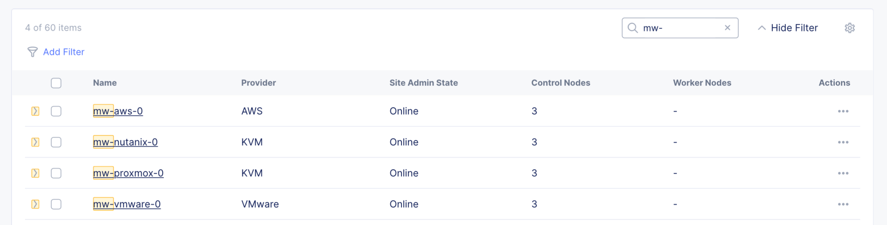

prototype deployment of F5 XC sites on VMWare, KVM and AWS



Copy terraform.tfvars.examples to terraform.tfvars and fill out the variables.

```
$ terraform apply --auto-approve

. . .

Apply complete! Resources: 9 added, 0 changed, 0 destroyed.

Outputs:

ip_address = [
  [
    {
      "10.0.1.96" = "3.139.157.31"
      "10.0.2.250" = "18.221.162.211"
      "10.0.3.138" = "3.20.147.194"
    },
  ],
  [
    {
      "mw-proxmox-0-m0" = "192.168.42.145"
      "mw-proxmox-0-m1" = "192.168.42.146"
      "mw-proxmox-0-m2" = "192.168.42.144"
    },
  ],
  [
    {
      "mw-vmware-0-m0" = "192.168.42.143"
      "mw-vmware-0-m1" = "192.168.42.142"
      "mw-vmware-0-m2" = "192.168.42.141"
    },
  ],
  [
    {
      "mw-nutanix-0-m0" = "192.168.42.139"
      "mw-nutanix-0-m1" = "192.168.42.140"
      "mw-nutanix-0-m2" = "192.168.42.138"
    },
  ],
]
site = <sensitive>
```


